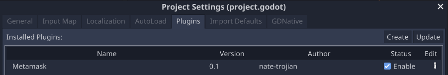

# MetamaskAddon

Addon for the Godot Engine for integrating with Metamask

## Install
~~Download from the Godot Asset Library~~ - _soon_

From Github

1. Clone the source code `https://github.com/nate-trojian/MetamaskAddon.git`
2. Copy everything in the `addons` folder to the `addons` folder in your Godot project
3. In Godot, go to `Project > Project Settings... > Plugins` and find the row with the name `Metamask`
4. Check the box in the `Status` column to `Enable`

## Example
If you've installed the addon from Github, you will be able to run the test scene located [here](https://github.com/nate-trojian/MetamaskAddon/tree/main/test)

All functionality in this addon has a sample implementation in this scene to show how it can be used.

## Usage
After install the plugin, a `Metamask` instance will be available anywhere in your Godot project as an [autoloaded singleton](https://docs.godotengine.org/en/stable/getting_started/step_by_step/singletons_autoload.html).

For more details on how you can use the Metamask instance, see the [Usage Doc](https://github.com/nate-trojian/MetamaskAddon/tree/main/addons/metamask/usage.md) in the addons folder
